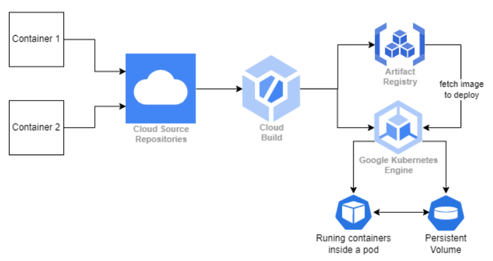

# Microservices deployment on K8s 

## Project Overview
I have created a modular, K8s-native project designed to deploy and manage containerized microservices on Google Kubernetes Engine (GKE) using cloud-native CI/CD pipelines and Infrastructure as Code (IaC) principles.

## Architecture

A cluster with 1 node is being used.
The node will run 2 Pods with 1 container in each. One of microservice 1 and another of microservice 2.

Pod of microservice 1 is exposed outside the cluster, via Loadbalancer service.

Pod of microservice 2 is exposed just inside the cluster via ClusterIP service so that microservice-1 can make calls.

A persistent volume is created using a persistent volume chain which uses the storage class provided by GCP. This volume is shared between both microservices.

## Technology Overview
 - For creating **microservices**: `Node.js` was used. 
 - For **containerization**: `Docker` 
 - For **CI/CD**: `GCP Cloud Build` 
 - For **container registry**: `GCP Artifact Registry` 
 - For **k8s cluster**: `Google Kubernetes Engine (GKE)` 
 - For **Infrastructure as Code (IaC)**: `Terraform` 
 - Additionally, `GCP Source Repository` was used for version control.

## Deployment Workflow
 - Provision Infrastructure using Terraform scripts.
 - Push Code to GitHub to trigger Cloud Build pipelines.
 - Images are built and stored in Artifact Registry.
 - Kubernetes YAMLs in each service deploy the services to GKE.
 - Services interact with each other via API and share files via Persistent Volume.

## Flow of Execution
Whenever a commit is pushed in any microservice-specific repository in GCP Source Repository, the CI/CD pipeline will trigger in the GCP Cloud Build, which will first build the docker image, push it to the GCP artifact registry and then deploy it to the k8s cluster using the manifest files (YAML files).

